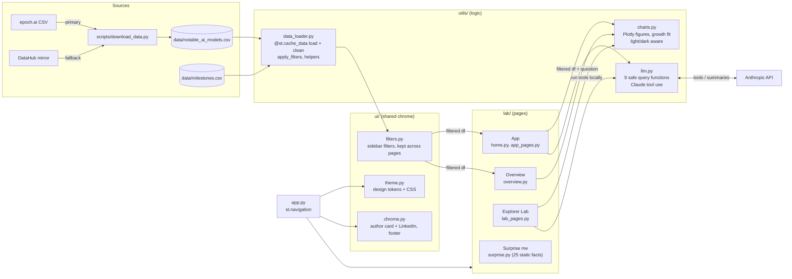

# AI Model Evolution Explorer

An interactive Streamlit app for exploring how AI models have grown from 1950 to today: training compute, parameter counts, training cost, openness, and who builds them. It uses Epoch AI's [Notable AI Models](https://epoch.ai/data/notable-ai-models) dataset (1,000+ models).

**Pages** (sidebar navigation, light and dark themes that follow your system setting):

- **App**
  - **Start here:** headline numbers, the three eras of AI, and where to go next.
  - **Explorer:** a log-scale **Compute Over Time** scatter. You can switch the y-axis between training compute, parameters, and cost. It includes a fitted growth trend (about 4.3× per year since 2010), shaded eras, and milestone markers, followed by breakdown charts: top organizations, models per year by domain, and open vs. closed weights.
  - **Ask the Data:** plain-English questions answered by Claude through **tool use**. Claude chooses one of 9 safe, predefined query functions, the app runs it on the filtered data, and Claude summarizes the result. It never generates or executes code. An **Era Summary** button writes a short narrative of the selected period.
- **Overview:** Milestones timeline, Frontier leaderboard, Browse the data (search + CSV export), and How it's built.
- **Explorer Lab · built step by step:** six pages, one per build step (cleaning, log scales, the growth fit, stable filter colours, milestones, safe tool use). Each has a live experiment, the key code read from the source, lessons learned, and knowledge nuggets.
- **Surprise me:** 25 curated AI facts, each posed as a question you reveal, with next / previous / shuffle.
- **Sidebar filters** (year range, domain, organization, accessibility, frontier-only) apply to every chart, table, and LLM query, and carry over between pages.

## Screenshots

> _Placeholder: add screenshots before submission._
>
> | Overview | Timeline | Frontier Leaderboard | Ask the Data |
> |---|---|---|---|
> | `docs/overview.png` | `docs/timeline.png` | `docs/leaderboard.png` | `docs/ask.png` |

## Setup

Requires Python 3.10+.

```bash
# 1. Virtual environment
python3 -m venv .venv            # or: uv venv --python 3.12 .venv
source .venv/bin/activate
pip install -r requirements.txt

# 2. Data (skips if already present; --force to re-download)
python scripts/download_data.py

# 3. Secrets (optional; only needed for the Ask the Data tab)
cp .streamlit/secrets.toml.example .streamlit/secrets.toml
# then set ANTHROPIC_API_KEY in .streamlit/secrets.toml (gitignored)

# 4. Run
streamlit run app.py
```

Without an API key, every tab except Ask the Data works normally.

**Tests** (offline, no API calls):

```bash
python tests/test_growth.py   # growth-rate fit
python tests/test_llm.py      # query functions + tool-use loop with a fake client
```

## Architecture



**How Ask the Data works:** the question and a description of the active filters go to Claude along with 9 tool definitions (`count_by_org`, `top_models_by_compute`, `models_in_range`, `domain_trend`, `open_vs_closed`, `growth_rate`, …). Claude replies with a `tool_use` block. The app checks the arguments against that tool's schema, runs the matching pandas function on the filtered DataFrame, and sends the result table back as a `tool_result`. Claude then answers in 2–3 sentences. The expander under each answer shows the functions and arguments that were used.

| Path | Purpose |
|---|---|
| `app.py` | Streamlit entry point: registers the pages in the App / Overview / Explorer Lab / Surprise me groups |
| `lab/home.py`, `lab/app_pages.py` | App: Start here, Explorer, Ask the Data |
| `lab/overview.py` | Overview: milestones timeline, frontier leaderboard, data browser, how it's built |
| `lab/lab_pages.py` | Explorer Lab: six build steps with live experiments, key code and knowledge nuggets |
| `lab/surprise.py` | Surprise me: 25 hand-written AI facts, one at a time |
| `lab/nav.py` | Page registry, Lab tour order, Previous / Next buttons |
| `ui/theme.py`, `.streamlit/config.toml` | Claude-style light/dark theme shared with the RAG and Travel Agent projects |
| `ui/filters.py` | Sidebar filters shared by every data page |
| `ui/chrome.py` | Author card with LinkedIn link, footer, data credit |
| `utils/data_loader.py` | Cached loading/cleaning, filters, milestone and leaderboard helpers |
| `utils/charts.py` | All Plotly chart builders and the log-linear growth fit |
| `utils/llm.py` | Anthropic client, safe query functions, tool-use loop, era summary |
| `scripts/download_data.py` | Dataset download with fallback and CSV validation |
| `data/milestones.csv` | Curated AI milestones (date, title, description) |
| `tests/` | Offline sanity tests |

## Data credit

Data: Epoch AI (CC-BY 4.0). "Data on Notable AI Models", Epoch AI, https://epoch.ai/data/notable-ai-models. Milestones are curated for this project.
