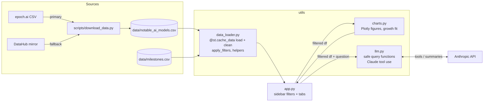

# AI Model Evolution Explorer

An interactive Streamlit app for exploring how AI models have grown from 1950 to today: training compute, parameter counts, training cost, openness, and who builds them. It uses Epoch AI's [Notable AI Models](https://epoch.ai/data/notable-ai-models) dataset (1,000+ models).

**Features**

- **Overview:** KPI cards and a log-scale **Compute Over Time** scatter. You can switch the y-axis between training compute, parameters, and cost. The scatter includes a fitted growth trend (compute has grown about 4.3× per year since 2010), shaded eras, and milestone markers. Below it are breakdown charts: top organizations, models per year by domain, and open vs. closed weights. A searchable table with CSV export finishes the tab.
- **Timeline:** 16 AI milestones from the Perceptron (1958) to the first 10²⁷ FLOP model (2026). Each shows the highest-compute models released within ±6 months of it.
- **Frontier Leaderboard:** the highest-compute model for each year, as a step chart and a table.
- **Ask the Data:** plain-English questions answered by Claude through **tool use**. Claude chooses one of 9 safe, predefined query functions, the app runs it on the filtered data, and Claude summarizes the result. It never generates or executes code. An **Era Summary** button writes a short narrative of the selected period.
- **Sidebar filters:** year range, domain, organization, accessibility, and frontier-only. They apply to every chart, table, and LLM query.

## Screenshots

> _Placeholder: add screenshots before submission._
>
> | Overview | Timeline | Frontier Leaderboard | Ask the Data |
> |---|---|---|---|
> | `docs/overview.png` | `docs/timeline.png` | `docs/leaderboard.png` | `docs/ask.png` |

## Setup

Requires Python 3.10+.

```bash
# 1. Virtual environment
python3 -m venv .venv            # or: uv venv --python 3.12 .venv
source .venv/bin/activate
pip install -r requirements.txt

# 2. Data (skips if already present; --force to re-download)
python scripts/download_data.py

# 3. Secrets (optional; only needed for the Ask the Data tab)
cp .streamlit/secrets.toml.example .streamlit/secrets.toml
# then set ANTHROPIC_API_KEY in .streamlit/secrets.toml (gitignored)

# 4. Run
streamlit run app.py
```

Without an API key, every tab except Ask the Data works normally.

**Tests** (offline, no API calls):

```bash
python tests/test_growth.py   # growth-rate fit
python tests/test_llm.py      # query functions + tool-use loop with a fake client
```

## Architecture



**How Ask the Data works:** the question and a description of the active filters go to Claude along with 9 tool definitions (`count_by_org`, `top_models_by_compute`, `models_in_range`, `domain_trend`, `open_vs_closed`, `growth_rate`, …). Claude replies with a `tool_use` block. The app checks the arguments against that tool's schema, runs the matching pandas function on the filtered DataFrame, and sends the result table back as a `tool_result`. Claude then answers in 2–3 sentences. The expander under each answer shows the functions and arguments that were used.

| Path | Purpose |
|---|---|
| `app.py` | Streamlit entry point: layout, sidebar filters, tabs |
| `utils/data_loader.py` | Cached loading/cleaning, filters, milestone and leaderboard helpers |
| `utils/charts.py` | All Plotly chart builders and the log-linear growth fit |
| `utils/llm.py` | Anthropic client, safe query functions, tool-use loop, era summary |
| `scripts/download_data.py` | Dataset download with fallback and CSV validation |
| `data/milestones.csv` | Curated AI milestones (date, title, description) |
| `tests/` | Offline sanity tests |

## Data credit

Data: Epoch AI (CC-BY 4.0). "Data on Notable AI Models", Epoch AI, https://epoch.ai/data/notable-ai-models. Milestones are curated for this project.
