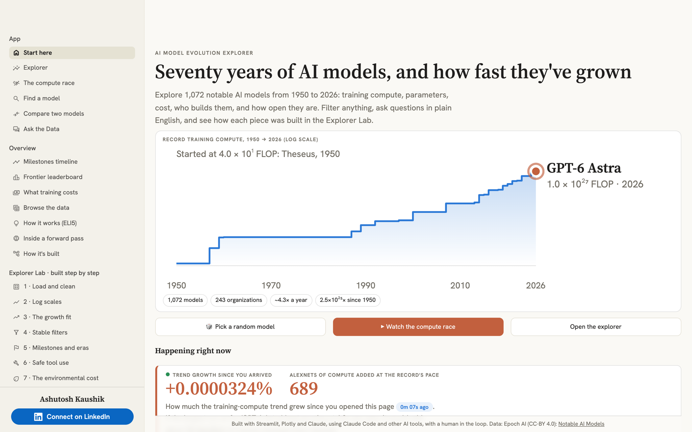
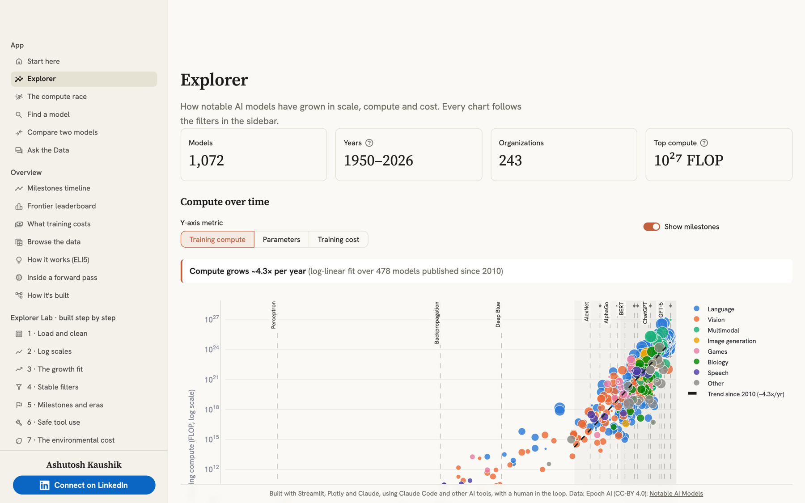
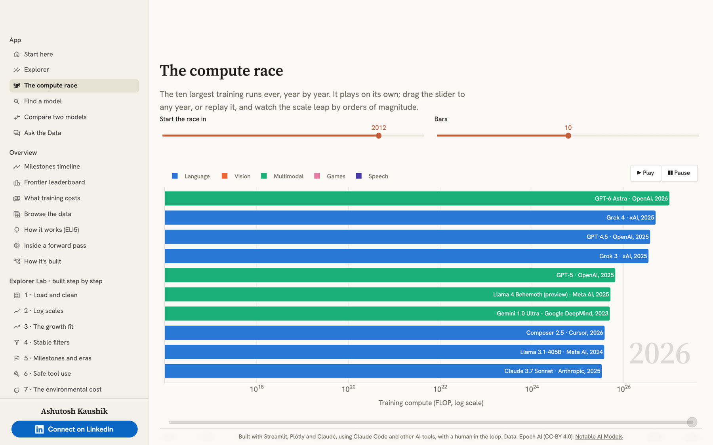
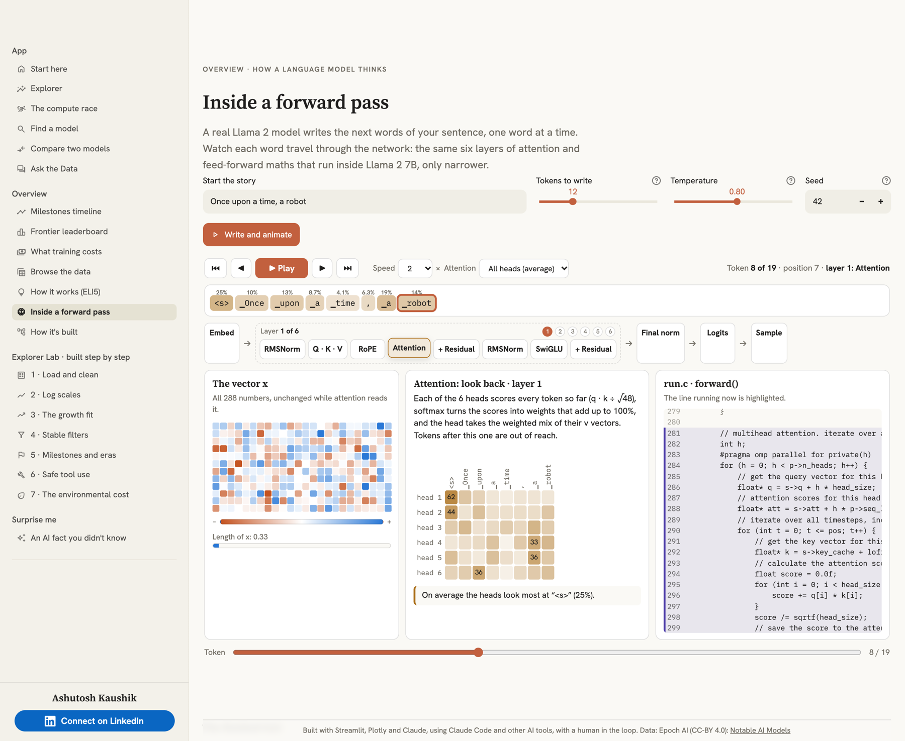
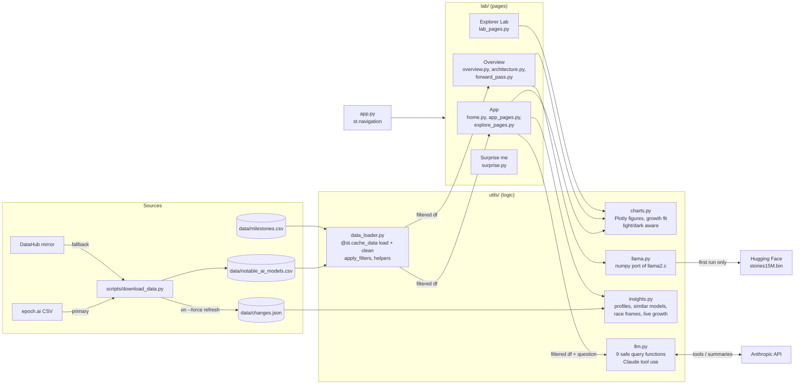

# AI Model Evolution Explorer

**▶ Live app: [ai-model-explorer.streamlit.app](https://ai-model-explorer.streamlit.app/)**

An interactive Streamlit app that shows how AI models have grown from 1950 to today: training compute, parameter counts, training cost, openness, and who builds them. It uses Epoch AI's [Notable AI Models](https://epoch.ai/data/notable-ai-models) dataset (1,000+ models), and a real Llama 2 model you can watch think.

**Part of a three-app series**, all with the same look and layout:
[AI Model Evolution Explorer](https://ai-model-explorer.streamlit.app/) ·
[AI History Research Assistant](https://ai-history-rag.streamlit.app/) (RAG) ·
[Travel Agent Lab](https://ai-travel-agent.streamlit.app/) (multi-agent)

## Screenshots

| | |
|---|---|
|  |  |
| Start here: the record training compute, 1950 → today | Explorer: compute over time, with the growth trend and milestones |
|  |  |
| The compute race: the ten largest training runs, year by year | Inside a forward pass: a real Llama 2 model, layer by layer |

## What's inside

The sidebar groups the pages. Light and dark themes follow your system setting.

### App
- **Start here:** a sparkline of the record training compute (1950 → today) that draws itself on load, a 🎲 random model button, a live counter of how much the compute trend grows in your first 10 seconds, the three eras of AI, and what's new in the data.
- **Explorer:** a log-scale *Compute Over Time* scatter (switch the y-axis between compute, parameters and cost) with a fitted growth trend (about 4.3× per year since 2010), shaded eras and milestone markers, plus breakdowns by organization, domain and open vs. closed weights.
- **The compute race:** an animated bar race of the ten largest training runs, year by year from 2012.
- **Find a model:** a profile card for any model: its rank that year, percentile, distance from the trend line, and the most similar models. The URL updates, so you can share a link.
- **Compare two models:** side by side, with a headline like "GPT-3 used 668,085× the training compute of AlexNet".
- **Ask the Data:** plain-English questions answered by Claude through tool use. Claude picks one of 9 safe, predefined query functions and summarizes the result; it never writes or runs code.

### Overview
- **Milestones timeline** and **Frontier leaderboard** (the running record holder, year by year).
- **What training costs:** cost per run over time, next to familiar price tags.
- **Browse the data:** search and CSV export.
- **How it works (ELI5):** the whole app as one simple diagram.
- **Inside a forward pass:** a real Llama 2 model ([stories15M](https://github.com/karpathy/llama2.c)) writes the next words of your sentence while an animation steps through every layer: embedding, attention, SwiGLU, logits and sampling, next to the matching lines of `run.c`.
- **How it's built:** files and layers.

### Explorer Lab · built step by step
Seven pages, one per build step (cleaning, log scales, the growth fit, stable filter colours, milestones, safe tool use, and the environmental cost of training). Each has a live experiment, the key code read from the source, and what was learned.

### Surprise me
25 hand-written AI facts, revealed one at a time.

**Sidebar filters** (year range, domain, organization, accessibility, frontier only) apply to every chart, table and question, and carry over between pages.

## How it works



**Ask the Data:** the question and the active filters go to Claude with 9 tool definitions (`count_by_org`, `top_models_by_compute`, `domain_trend`, `growth_rate`, …). Claude replies with a `tool_use` block; the app checks the arguments against that tool's schema, runs the matching pandas function on the filtered data, and returns the table as a `tool_result`. Claude then answers in 2–3 sentences, and an expander shows exactly which functions ran.

**Inside a forward pass:** `utils/llama.py` is a numpy port of Karpathy's `run.c`, with the same tokenizer and random number generator, so a seed here writes the same story as `./run -s`. It records every attention weight and the vector *x* after each step; the page sends that trace to the browser as JSON and animates it there.

## Tech stack

| Layer | Tools |
|---|---|
| App | Streamlit (`st.navigation`, fragments, cached data) |
| Charts | Plotly |
| Data | pandas, Epoch AI's Notable AI Models CSV |
| LLM | Claude via the Anthropic API (tool use) |
| Model demo | numpy port of llama2.c running stories15M |
| Tests | plain Python test scripts, offline |

## Run it locally

Requires Python 3.10+.

```bash
python3 -m venv .venv                # or: uv venv --python 3.12 .venv
source .venv/bin/activate
pip install -r requirements.txt
python scripts/download_data.py      # skips if present; --force to refresh
cp .streamlit/secrets.toml.example .streamlit/secrets.toml   # optional: set ANTHROPIC_API_KEY for Ask the Data
streamlit run app.py
```

Without an API key, every page except Ask the Data works. *Inside a forward pass* reads the model from `~/Projects/llama2.c` if you have it (set `LLAMA2C_DIR` for another folder), and otherwise downloads it (60 MB) on first use.

**Tests** (offline, no API calls):

```bash
python tests/test_growth.py     # growth-rate fit
python tests/test_llm.py        # query functions + tool-use loop with a fake client
python tests/test_insights.py   # profiles, comparisons, race frames, downloader change log
python tests/test_surprise.py   # the 25 static facts
python tests/test_llama.py      # numpy llama2.c port vs ./run output
```

## Deploy to Streamlit Community Cloud

1. At [share.streamlit.io](https://share.streamlit.io), click **Create app**, pick this repo and set the main file to `app.py`.
2. Optional: under *Advanced settings → Secrets*, add `ANTHROPIC_API_KEY = "sk-ant-..."` to turn on Ask the Data.
3. Deploy. Every push to `main` redeploys the app.

## Project layout

| Path | Purpose |
|---|---|
| `app.py` | Entry point: registers the pages in the App / Overview / Explorer Lab / Surprise me groups |
| `lab/home.py`, `lab/app_pages.py` | Start here, Explorer, Ask the Data |
| `lab/explore_pages.py` | The compute race, Find a model, Compare two models, What training costs |
| `lab/overview.py`, `lab/architecture.py` | Timeline, leaderboard, data browser, How it works (ELI5), How it's built |
| `lab/forward_pass.py`, `lab/forward_pass.html` | Inside a forward pass: the page and its browser animation |
| `lab/lab_pages.py`, `lab/nav.py` | Explorer Lab pages, page registry and Previous / Next buttons |
| `lab/surprise.py` | The 25 static AI facts |
| `ui/theme.py`, `ui/filters.py`, `ui/chrome.py` | Theme tokens, shared sidebar filters, author card and footer |
| `utils/data_loader.py` | Cached loading and cleaning, filters, leaderboard helpers |
| `utils/charts.py` | Every Plotly chart and the growth fit |
| `utils/insights.py` | Model profiles, comparisons, race frames, live growth, what's new |
| `utils/llm.py` | Anthropic client, safe query functions, tool-use loop |
| `utils/llama.py` | numpy port of llama2.c (model, tokenizer, sampler, traced forward pass) |
| `scripts/download_data.py` | Dataset download with fallback and validation |
| `data/milestones.csv` | Curated AI milestones |
| `tests/` | Offline tests |

## Credits

- Data: Epoch AI (CC-BY 4.0), [Data on Notable AI Models](https://epoch.ai/data/notable-ai-models). Milestones are curated for this project.
- Model: stories15M from Andrej Karpathy's [llama2.c](https://github.com/karpathy/llama2.c) (MIT), trained on TinyStories.
- Built by Ashutosh Kaushik · [LinkedIn](https://www.linkedin.com/in/ashutosh-kaushik/)
